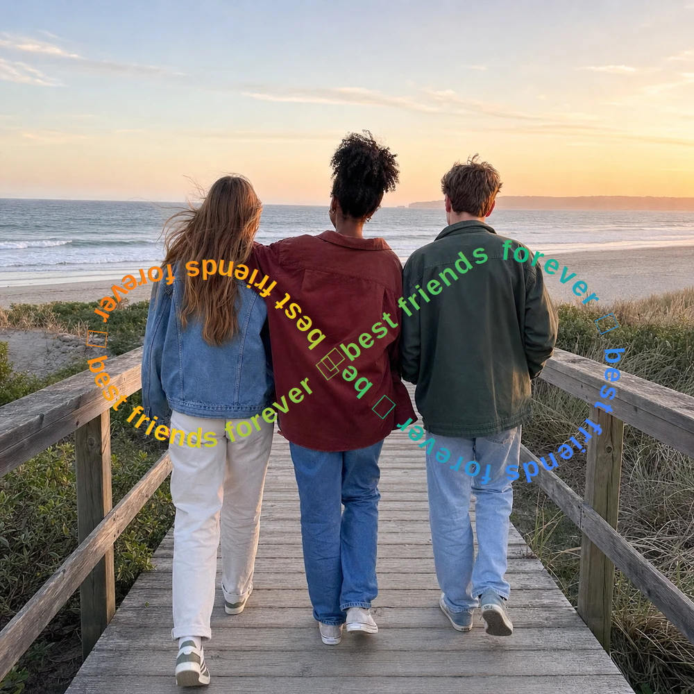
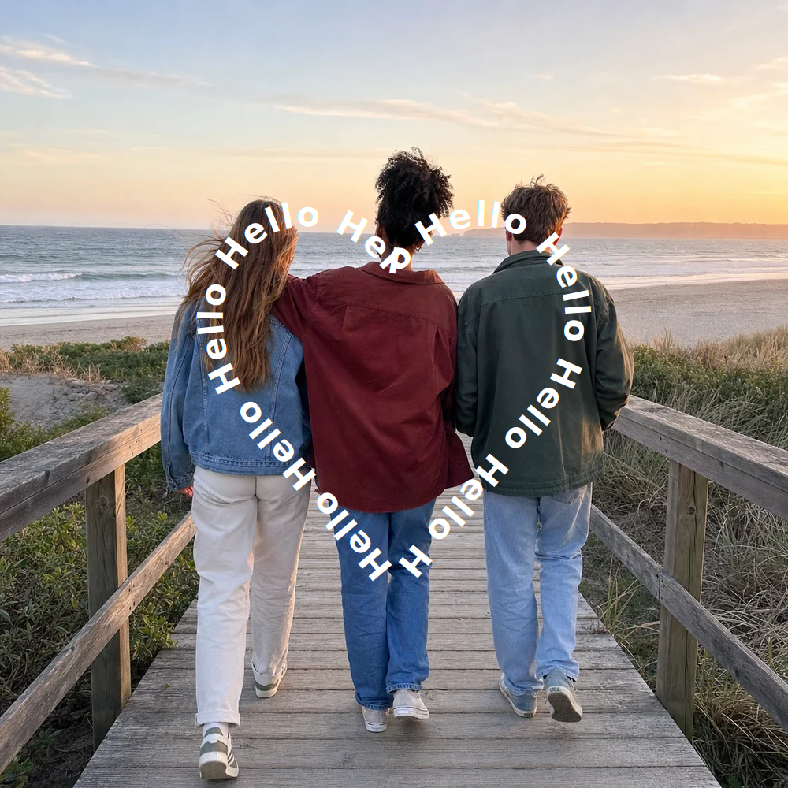
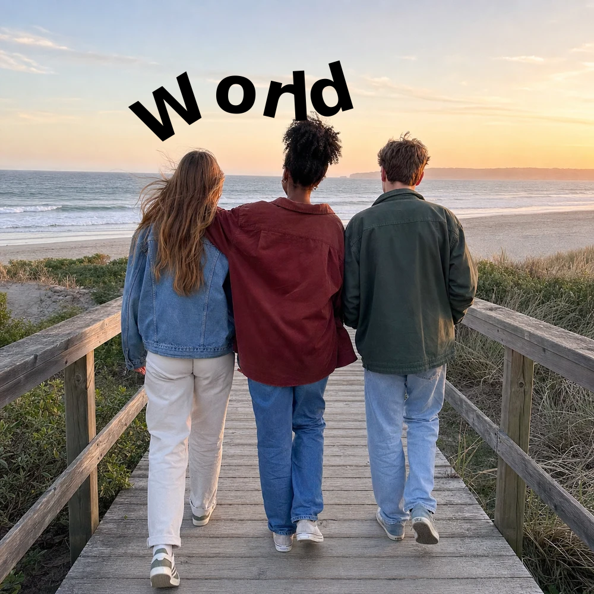

# Brush Photo & Video Library

Type some words, draw a line over a photo, and this library makes the words follow that line.

This repository implements the same text-on-path brush algorithm in 20 popular programming languages. Every directory contains a dependency-free library and a runnable example that embeds a photo, builds a smooth path, lays repeated Unicode text on it, and writes a standalone SVG.

**Live implementation:** [text-brush.com](https://text-brush.com?utm_source=gh_brush_lib)

| Original photo | Type text + draw an infinity path |
| --- | --- |
|  |  |

The right-hand image is generated by the TypeScript port using the same example photo as [text-brush.com](https://text-brush.com?utm_source=gh_brush_lib). The SVG contains both the original raster image and the rendered brush, so it can be opened or shared as one file.

| White brush: “Hello” | Black brush: “World” |
| --- | --- |
|  |  |

These two single-word examples use the same TypeScript renderer with text repetition disabled. “Hello” follows a curve over the darker foreground in white, while “World” follows a curve across the bright sky in black.

## Why this is a demanding photo-editing problem

At first glance, curved text sounds like “put each letter on a line.” Real pointer input makes it much harder:

- Touch and mouse events arrive at uneven times and include hand jitter, duplicate points, and tiny reversals.
- Raw polylines create visibly sharp corners. Large type needs broader rounding than small type, but short segments must not be swallowed by a large radius.
- Characters must advance by distance along the curve, not by point index. Otherwise dense input regions squeeze the text while sparse regions stretch it.
- A glyph needs a stable tangent. Using one tiny segment makes letters shake; averaging too broadly makes them cut corners.
- Emoji, combining marks, right-to-left scripts, Indic clusters, fallback fonts, XML escaping, and browser font shaping all affect correctness.
- An editor needs fast interactive previews and deterministic export. For video, the same geometry must also remain stable from frame to frame.

The algorithm solves those concerns in a small, portable pipeline. It is suitable for photo editors, story and reel tools, greeting-card apps, poster makers, caption effects, and video overlays.

## TypeScript quick start

TypeScript is the reference portable implementation. It needs no package install on Node.js versions that support native type stripping.

```ts
import { readFileSync, writeFileSync } from "node:fs";
import { renderSvg, type Point } from "./languages/typescript/brush.ts";

const points: Point[] = [
  { x: 120, y: 520 },
  { x: 250, y: 370 },
  { x: 500, y: 520 },
  { x: 750, y: 370 },
  { x: 875, y: 545 },
];

const svg = renderSvg(
  readFileSync("assets/example.webp"),
  "image/webp",
  1000,
  1000,
  points,
  "🤝 best friends forever",
  { fontSize: 40, magicGradient: true, shadow: true }
);

writeFileSync("result.svg", svg);
```

Run the complete infinity-path example from the repository root:

```sh
node --experimental-strip-types languages/typescript/example.ts
```

The public API is intentionally similar in every port, with idiomatic casing for each language:

- `createDrawingPath` / `create_drawing_path` starts a live stroke.
- `appendDrawingPoint` / `append_drawing_point` filters and adds a pointer sample.
- `buildRoundedDrawingPath` / `build_rounded_drawing_path` creates SVG path data.
- `prepareArcLengthPath` / `prepare_arc_length_path` builds the distance map.
- `sampleAt` / `sample_at` returns a position, tangent angle, and bounded progress.
- `stableRepeatedText` (or the equivalent name) makes enough copies to cover long paths.
- `renderSvg` / `render_svg` returns the self-contained final SVG.

Coordinates use the SVG/image coordinate system. The renderers accept PNG, JPEG, WebP, GIF, or AVIF bytes and escape user-controlled XML values. Options cover font size and family, weight, letter spacing, solid or magic-gradient fill, opacity, outline, shadow, repetition, and reveal progress.

## How the algorithm works

### 1. Normalize pointer input

Non-finite coordinates are rejected. During drawing, a sample less than **3 units** from the last retained point is treated as jitter and ignored. This removes the high-frequency noise that would otherwise make letters wobble.

### 2. Compress nearly straight movement

For every new sample, the direction change at the pending endpoint is measured with a normalized dot product:

```text
angle = acos(clamp(dot(incoming, outgoing) / (|incoming| |outgoing|), -1, 1))
```

When the angle is below **18°**, the pending endpoint is replaced rather than appending another anchor. Long straight gestures therefore remain light and stable without losing meaningful bends.

### 3. Round corners with quadratic Bézier curves

Each retained interior anchor becomes a quadratic Bézier control point. The preferred rounding distance grows with the type:

```text
preferred radius = max(12, font size × 1.25)
trim distance    = min(preferred radius,
                       incoming segment × 0.45,
                       outgoing segment × 0.45)
```

The 45% cap prevents the entry and exit trims from crossing on short segments. The path uses a line to the entry point, a quadratic curve through the original corner, and then continues from the exit point. That is why tight angles look smooth without flattening the overall gesture.

### 4. Simplify the export path

For arc-length work, consecutive points closer than **0.5 units** are collapsed and Ramer–Douglas–Peucker simplification runs at half that threshold, with a 0.1-unit floor. This reduces redundant work while preserving the path shape and its endpoints.

### 5. Build cumulative arc length

Every simplified segment stores its start distance and length. Their cumulative total turns a normalized progress value into a physical distance. A binary search in the reference ports, or a simple segment scan in the compact ports, then finds the containing segment and interpolates the exact point.

This distance map is the key to even visual spacing: text follows traveled distance rather than the number or timing of pointer events.

### 6. Estimate a stable tangent

At a requested distance, the sampler reads points just before and after it and calculates:

```text
angle = atan2(after.y - before.y, after.x - before.x)
```

The sampling window is font-size-aware, bounded by the path length, and never smaller than 0.75 units. This secant tangent smooths noisy micro-angles while still reacting to real curves.

### 7. Shape and draw the text

The portable renderers emit an SVG `<textPath>`, leaving Unicode shaping, ligatures, fallback fonts, and bidirectional layout to the SVG viewer. The text is repeated enough times to cover very long paths, with a safety cap of 256 repetitions.

The Swift port additionally includes a native CoreText whole-phrase shaper and per-glyph placement API. Shaping the complete phrase before placing glyph clusters preserves contextual Arabic forms, right-to-left visual order, Indic clusters, emoji sequences, and fallback font runs on Apple platforms.

### 8. Render and animate

The final SVG embeds the source photo as base64 and draws text with an optional outline, shadow, and six-stop gradient. A normalized path mask reveals the brush using `revealProgress` from 0 to 1. Photo output is immediate; a video pipeline can render the same SVG geometry at increasing progress values and composite those frames before encoding.

The repository deliberately does not prescribe a video codec or encoder. Its responsibility is stable, deterministic frame geometry; FFmpeg, AVFoundation, MediaCodec, or another host pipeline can handle frame composition and encoding.

## Why the result looks good

- **Smooth angles:** font-size-aware quadratic rounding removes mechanical corners.
- **Even spacing:** cumulative arc length decouples layout from pointer-event density.
- **Stable orientation:** a bounded secant tangent avoids letter-by-letter twitching.
- **Responsive drawing:** jitter rejection and straight-line compression keep the live path small.
- **Resolution independence:** geometry and type remain vector data until final composition.
- **Deterministic export:** identical points and settings produce the same path across the ports.
- **Unicode preservation:** the full phrase reaches the platform or SVG shaping engine instead of being split into unsafe bytes.

## Supported languages

The selection follows the “all respondents” results in the [2025 Stack Overflow Developer Survey](https://survey.stackoverflow.co/2025/technology#most-popular-technologies-language), the latest published results while this repository was prepared. It takes the 20 highest-ranked general-purpose application languages after excluding markup, query, shell, and assembly entries, whose ports would be wrappers or platform-specific rather than comparable library implementations.

| Language | Survey usage | Library | Example | Verified here |
| --- | ---: | --- | --- | --- |
| JavaScript | 66.0% | [`brush.mjs`](languages/javascript/brush.mjs) | [`example.mjs`](languages/javascript/example.mjs) | Execute + SVG |
| Python | 57.9% | [`brush.py`](languages/python/brush.py) | [`example.py`](languages/python/example.py) | Execute + SVG |
| TypeScript | 43.6% | [`brush.ts`](languages/typescript/brush.ts) | [`example.ts`](languages/typescript/example.ts) | Execute + SVG |
| Java | 29.4% | [`Brush.java`](languages/java/Brush.java) | [`Example.java`](languages/java/Example.java) | Compile + SVG |
| C# | 27.8% | [`Brush.cs`](languages/csharp/Brush.cs) | [`Example.cs`](languages/csharp/Example.cs) | Static review |
| C++ | 23.5% | [`brush.hpp`](languages/cpp/brush.hpp) | [`example.cpp`](languages/cpp/example.cpp) | Compile + SVG |
| C | 22.0% | [`brush.h`](languages/c/brush.h) | [`example.c`](languages/c/example.c) | Compile + SVG |
| PHP | 18.9% | [`brush.php`](languages/php/brush.php) | [`example.php`](languages/php/example.php) | Static review |
| Go | 16.4% | [`brush.go`](languages/go/brush.go) | [`main.go`](languages/go/example/main.go) | Execute + SVG |
| Rust | 14.8% | [`brush.rs`](languages/rust/brush.rs) | [`example.rs`](languages/rust/example.rs) | Compile + SVG |
| Kotlin | 10.8% | [`Brush.kt`](languages/kotlin/Brush.kt) | [`Example.kt`](languages/kotlin/Example.kt) | Compile + SVG |
| Lua | 9.2% | [`brush.lua`](languages/lua/brush.lua) | [`example.lua`](languages/lua/example.lua) | Execute + SVG |
| Ruby | 6.4% | [`brush.rb`](languages/ruby/brush.rb) | [`example.rb`](languages/ruby/example.rb) | Execute + SVG |
| Dart | 5.9% | [`brush.dart`](languages/dart/brush.dart) | [`example.dart`](languages/dart/example.dart) | Static review |
| Swift | 5.4% | [`Brush.swift`](languages/swift/Brush.swift) | [`Example.swift`](languages/swift/Example.swift) | Compile + SVG |
| R | 4.9% | [`brush.R`](languages/r/brush.R) | [`example.R`](languages/r/example.R) | Static review |
| Groovy | 4.8% | [`Brush.groovy`](languages/groovy/Brush.groovy) | [`Example.groovy`](languages/groovy/Example.groovy) | Compile + SVG |
| Perl | 3.8% | [`Brush.pm`](languages/perl/Brush.pm) | [`example.pl`](languages/perl/example.pl) | Execute + SVG |
| Elixir | 2.7% | [`brush.ex`](languages/elixir/brush.ex) | [`example.exs`](languages/elixir/example.exs) | Static review |
| Scala | 2.6% | [`Brush.scala`](languages/scala/Brush.scala) | [`Example.scala`](languages/scala/Example.scala) | Static review |

“Static review” means that the implementation and example were completed and audited, but that language runtime was not present locally. No missing environment was installed just to run it. The other 14 examples passed their built-in geometry checks, generated well-formed SVG, and produced the same canonical infinity path.

## Directory structure

```text
brush-photo-video-lib/
├── assets/
│   ├── example-hello-white.svg
│   ├── example.webp
│   ├── example-output.svg
│   └── example-world-black.svg
├── languages/
│   ├── c/           brush.h + example.c
│   ├── cpp/         brush.hpp + example.cpp
│   ├── csharp/      Brush.cs + Example.cs
│   ├── dart/        brush.dart + example.dart
│   ├── elixir/      brush.ex + example.exs
│   ├── go/          brush.go + example/main.go
│   ├── groovy/      Brush.groovy + Example.groovy
│   ├── java/        Brush.java + Example.java
│   ├── javascript/  brush.mjs + example.mjs
│   ├── kotlin/      Brush.kt + Example.kt
│   ├── lua/         brush.lua + example.lua
│   ├── perl/        Brush.pm + example.pl
│   ├── php/         brush.php + example.php
│   ├── python/      brush.py + example.py
│   ├── r/           brush.R + example.R
│   ├── ruby/        brush.rb + example.rb
│   ├── rust/        brush.rs + example.rs
│   ├── scala/       Brush.scala + Example.scala
│   ├── swift/       Brush.swift + Example.swift
│   └── typescript/  brush.ts + example.ts
├── go.mod
├── LICENSE
└── README.md
```

Generated binaries and SVGs go under `generated/`, which is intentionally ignored by Git.

## Run any example

Run commands from the repository root. Each example defaults to `assets/example.webp` and writes `generated/<language>.svg`.

```sh
mkdir -p generated

# TypeScript / JavaScript
node --experimental-strip-types languages/typescript/example.ts
node languages/javascript/example.mjs

# Python / Ruby / Lua / Perl / PHP / R / Elixir / Dart
python3 languages/python/example.py
ruby languages/ruby/example.rb
lua languages/lua/example.lua
perl languages/perl/example.pl
php languages/php/example.php
Rscript languages/r/example.R
elixir languages/elixir/example.exs
dart run languages/dart/example.dart

# Swift on an Apple platform
swiftc languages/swift/Brush.swift languages/swift/Example.swift -o generated/swift-example
generated/swift-example

# Java
javac -d generated/java-classes languages/java/Brush.java languages/java/Example.java
java -cp generated/java-classes Example

# Kotlin
kotlinc languages/kotlin/Brush.kt languages/kotlin/Example.kt -include-runtime -d generated/kotlin.jar
java -jar generated/kotlin.jar

# Groovy
groovyc -d generated/groovy-classes languages/groovy/Brush.groovy languages/groovy/Example.groovy
groovy -cp generated/groovy-classes Example

# Scala
mkdir -p generated/scala-classes
scalac -d generated/scala-classes languages/scala/Brush.scala languages/scala/Example.scala
scala -cp generated/scala-classes Example

# Go
go run ./languages/go/example

# Rust
rustc --edition 2021 languages/rust/example.rs -o generated/rust-example
generated/rust-example

# C / C++
clang -std=c11 languages/c/example.c -lm -o generated/c-example
generated/c-example
clang++ -std=c++17 languages/cpp/example.cpp -o generated/cpp-example
generated/cpp-example

# C# (from a Developer Command Prompt with a current Roslyn compiler)
csc -out:generated/csharp-example.exe languages/csharp/Brush.cs languages/csharp/Example.cs
generated/csharp-example.exe
```

Most examples also accept input and output paths as their first two arguments. The implementations use only their language standard library. Swift uses the Apple CoreGraphics/CoreText frameworks for its additional native shaping API.

## Practical notes

- The SVG is the finished composited image; rasterize it only when a downstream service requires PNG or JPEG.
- Font appearance depends on fonts available in the SVG viewer. Supply a suitable `fontFamily`, or embed/outline fonts in your host application when exact typography is required.
- SVG `<textPath>` provides portable whole-string shaping. Swift’s `TextPathLayouter` is available when native per-glyph positions are needed.
- `revealProgress` controls the brush reveal mask, not video encoding. Render frames and pass them to the encoder used by your application.
- The examples use a 1000 × 1000 coordinate system. If your editor displays a scaled preview, convert pointer positions back into image/view-box coordinates before calling the library.

## Origin and license

The Swift and TypeScript implementations were adapted from the native and web versions of the Text Brush project, then ported with the same geometry constants and output behavior to the other 18 languages. See the effect in use at [text-brush.com](https://text-brush.com?utm_source=gh_brush_lib).

Released under the [MIT License](LICENSE).
